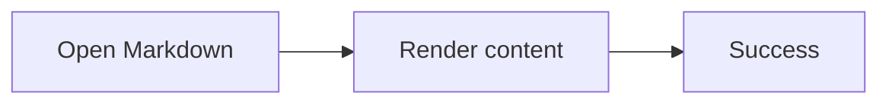
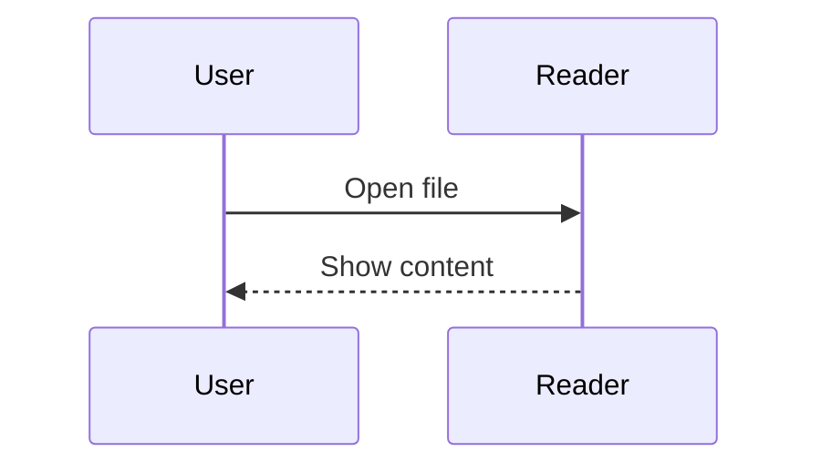
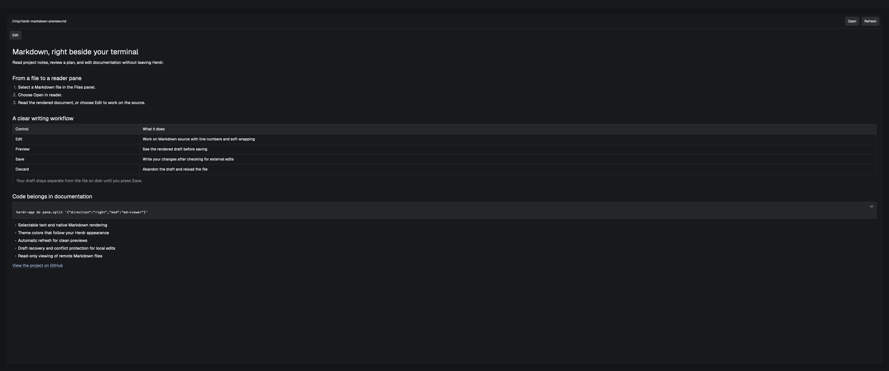

# Images and diagrams

## Flowchart


```mermaid
flowchart LR
    A[Open Markdown] --> B[Render content]
    B --> C[Success]
```

## Sequence diagram


```mermaid
sequenceDiagram
    participant User
    participant Reader
    User->>Reader: Open file
    Reader-->>User: Show content
```

## Normal code

```javascript
console.log("Normal code still works");
```

## Local image



## Remote image


